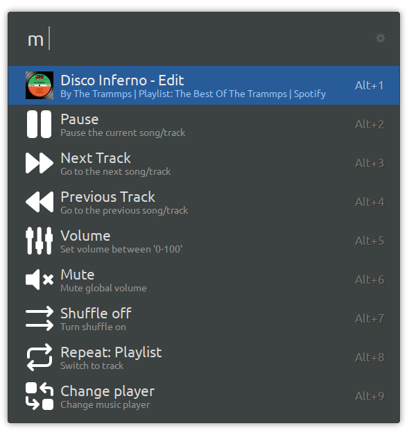
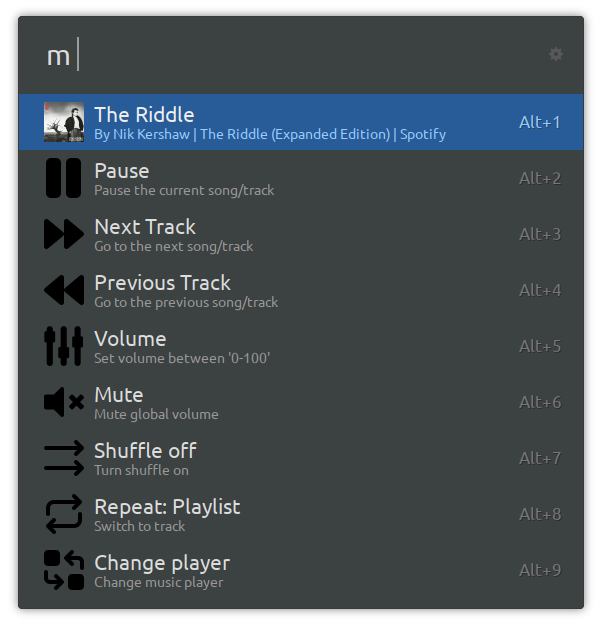
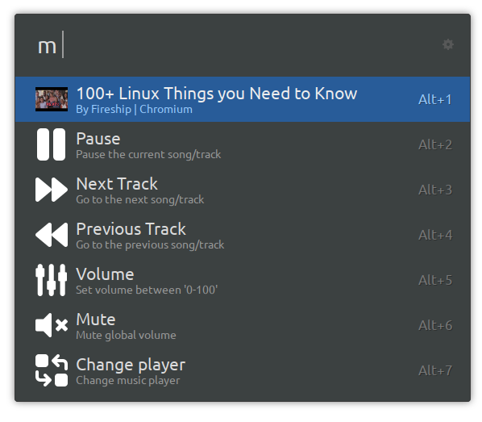
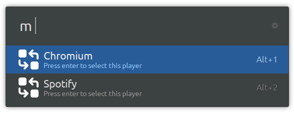

<h1 align="center" style="display: flex; align-items: center; justify-content: center;">
  
  | Media Controller for Ulauncher
</h1>


<blockquote align="center">
    <h3>
    Control your media. Anytime, anywhere.
    </h3>
    <p align="left">
        This project took heavy inspiration from 
        <a href="https://github.com/Dankni95/ulauncher-playerctl">
            ulauncher-playerctl</a>.
    </p>
</blockquote>


<table>
  <tr>
    <td></td>
    <td></td>
  </tr>
  <tr>
    <td></td>
    <td></td>
</table>


## 🏆 Features
- 🖼️ **Display Media Thumbnail**: View the thumbnail of the currently playing media.
- ⏯️ **Play/Pause Media**: Easily play and pause any media player.
- ⏭️ **Track Navigation**: Skip to the next or previous track effortlessly.
- 🔀 **Shuffle Control**: Toggle shuffle mode for your media player.
- 🔁 **Repeat Control**: Switch between repeat modes (off, playlist, track).
- 🔊 **Volume Control**: Adjust the system volume directly.
- 🎛️ **Multiple Media Players**: Manage multiple media players at once.

### 🎵 Aliases
Quickly control your audio with these aliases:
- `p` - Play/Pause
- `n` - Next Track
- `b` - Previous Track
- `v` - Volume
- `m` - Mute
- `r` - Change repeat (if supported)
- `s` - Toggle shuffle (if supported)

## 🐧 Installing

This extension requires `playerctl` to work.

To install it on Ubuntu, run:
```
sudo apt install playerctl
```

Then, install the repo via Ulauncher $\rightarrow$ Preferences $\rightarrow$ Extensions $\rightarrow$ Add Extension
```
https://github.com/E1Bos/ulauncher-media-controller
```

## ⭐ Special Thanks
- The [Ulauncher](https://ulauncher.io) developers 
- [Dankni95](https://github.com/Dankni95/ulauncher-playerctl) for the inspiration
- [tabler.io](https://tabler.io/icons) for the icons
